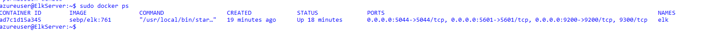

## Automated ELK Stack Deployment

The files in this repository were used to configure the network depicted below.

These files have been tested and used to generate a live ELK deployment on Azure. They can be used to either recreate the entire deployment pictured above. Alternatively, select portions of the ELK Setup Digram file may be used to install only certain pieces of it, such as Filebeat.

  - https://github.com/isyedazhar/devops-cloud-security/blob/main/Ansible/install-elk.yml
  - https://github.com/isyedazhar/devops-cloud-security/blob/main/Ansible/filebeat-config.yml
  - https://github.com/isyedazhar/devops-cloud-security/blob/main/Ansible/metricbeat-config.yml
  

This document contains the following details:
- Description of the Topologu
- Access Policies
- ELK Configuration
  - Beats in Use
  - Machines Being Monitored
- How to Use the Ansible Build

### Description of the Topology

The main purpose of this network is to expose a load-balanced and monitored instance of DVWA, the D*mn Vulnerable Web Application.

Load balancing ensures that the application will be highly available, in addition to restricting access to the network.

Load Balancing contributes to the Availability aspect of security in regards to the CIA Triad. Load balancers ensure that a network remains /available/ even in the midst of heavy traffic or attempted DoS attacks.
Jumpbox is another layer of security to attain Automation, Security, Network Segmentation, and Access Control.
The advantage of a JumpBox is that it provides another layer of abstraction before the webservers and acts as the orgin point for launching Administrative Tasks.This ultimately sets the JumpBox as a SAW (Secure Admin Workstation). All Administrators when conducting any Administrative Task will be required to connect to the JumpBox (SAW) before perfoming any task/assignment.
Furthermore , access from jumpservers to webservers is through the "ssh" from ansible container and cannot be easily detected. 
This provides defense in depth to our architecture model. 

Integrating an ELK server allows users to easily monitor the vulnerable VMs for changes to the logs and system traffic.

Filebeat allows security professionals to easily parse through logs files. Filebeat acts as a "middle" man, monitoring logs and then forwarding along the ones that it was configured to.
Metricbeat allows security professionals to monitor the health of their computer or servers. Metricbeat will watch and record metrics such as CPU & RAM usage.

The configuration details of each machine may be found below.

| Name     | Function    | IP Address | Operating System        |
|----------|-------------|------------|-------------------------|
| Jump Box | Gateway     | 10.0.0.4   | Linux (ubuntu 18.04)    |
| DVWA-VM1 | Docker-DVWA | 10.0.0.5   | Linux (ubuntu 18.04)    |
| DVWA-VM2 | Docker-DVWA | 10.0.0.6   | Linux (ubuntu 18.04)    |
|ELk-Server| ELK         | 10.1.0.4   | Linux (ubuntu 18.04)    |

### Access Policies

The machines on the internal network are not exposed to the public Internet. 

Only the JumpBox machine can accept connections from the Internet. Access to this machine is only allowed from the following IP addresses:
Personal IP Address

Machines within the network can only be accessed by SSH.
My personal public IP address is the only machine allowed access to the ELK-server via port 5601.

A summary of the access policies in place can be found in the table below.

| Name       | Publicly Accessible | Allowed IP Addresses |
|------------|---------------------|----------------------|
| Jump Box   | No                  | Personal Endpoint IP |
| DVWA-VM1   | No                  | 10.0.0.4             |
| DVWA-VM2   | No                  | 10.0.0.4             |
| Elk-Server | No                  | 10.0.0.4             |

### Elk Configuration

Ansible was used to automate configuration of the ELK machine. No configuration was performed manually, which is advantageous because...
- The main advantage of automating configuration through Ansible is the ease of use. 
- Another advantage would be YAML Playbooks. It is the best alternative for configuration management/automation.
- It is also able to automate complex multi-tier IT application environemtns.
- Highly secure as this is achieved by SSH and without requiring to be root.

The playbook implements the following tasks:

  Change the memory on the ELK VM
  Install docker.io
  Install python-pip
  Install docker python module
  Download and launch a docker elk stack

The following screenshot displays the result of running `docker ps` after successfully configuring the ELK instance.

### Target Machines & Beats
This ELK server is configured to monitor the following machines:
  - 10.0.0.5
  - 10.0.0.6

We have installed the following Beats on these machines:
  - Filebeat
  - Metricbeat

These Beats allow us to collect the following information from each machine:
  - Filebeat will collect log files (administrators can choose which they would like Filebeat to work on). These logs will be stored in Logstash for further analysis.
  - Metricbeat focuses on machine health and telemetry. It reports machine metrics back to the ELK Stack such as CPU load/usage as well as Memory.

### Using the Playbook
In order to use the playbook, you will need to have an Ansible control node already configured. Assuming you have such a control node provisioned: 

SSH into the control node and follow the steps below:
  - Copy the install_elk.yml,filebeat-config.yml and metricbeat-config.yml file to the /etc/ansible/ directory in you docker container.
  - Update the the configuration files to include the private Ip address for webservers and ElkVM.
  - Run the playbook and navigate to http://[your.ELK-VM.External.IP]:5601/app/kibana to ensure that the install worked as expected.
  - For Elk : The playbook is called install_elk.yml. You copy the file to the "/etc/ansible/" directory.
  - For Fliebeat : The playbook is called filebeat-config.yml. You copy the file to the "/etc/ansible/" directory.
  - For Metricbeat : The playbook is called metricbeat-config.yml. You copy the file to the "/etc/ansible/" directory.
  - Edit the /etc/ansible/hosts file to add webserver/elkserver ip addresses for Ansible to run the playbook on a specific machine/s.
  - Navigate to http://[your.ELK-VM.External.IP]:5601/app/kibana in order to check that the ELK server is running.

_As a **Bonus**, provide the specific commands the user will need to run to download the playbook, update the files, etc._
